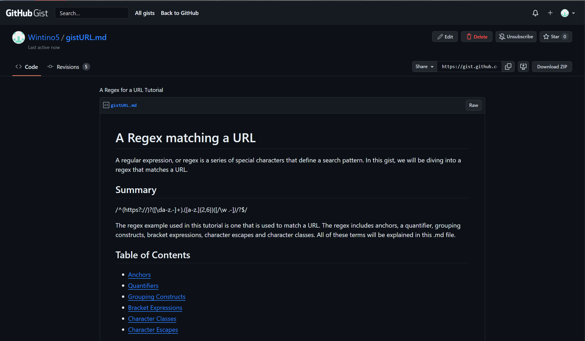

# Regex_TutorialWJR

## Description

In this challenge we learned about regular expressions also known as regex. A regex is a sequence of characters that defines a search pattern. They are used to validate whether a user is inputing a valid email address, username, phone number, url and many more. This assignment allowed me to learned more about the basics of coding and how regular expressions work.

## Repository

Link to gist: https://gist.github.com/Wintino5/25c8a76b1dc414bce3ee8ee3368285c9

## Technologies

- Written with gist and README.md

## License

MIT License

## Mock-Up

The following image shows the application's functionality and appearance:

